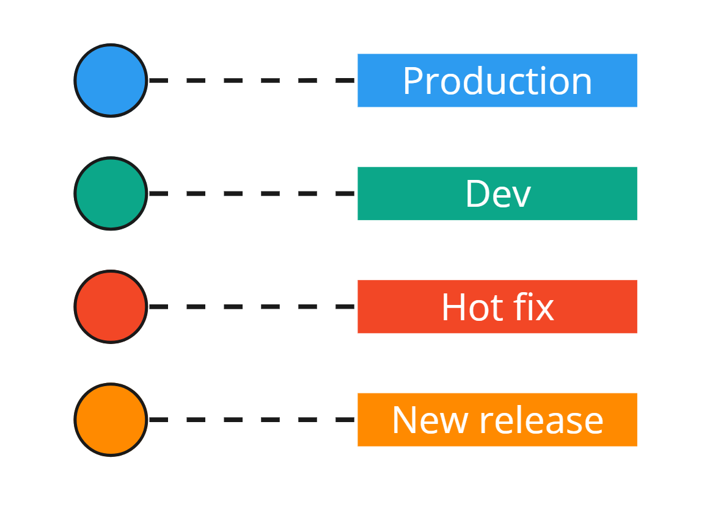
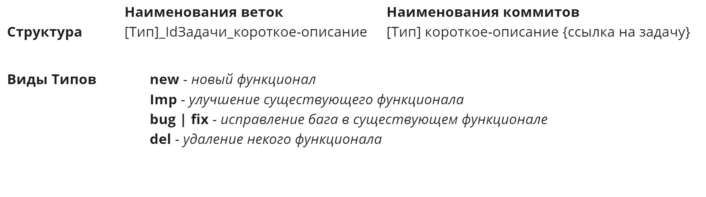
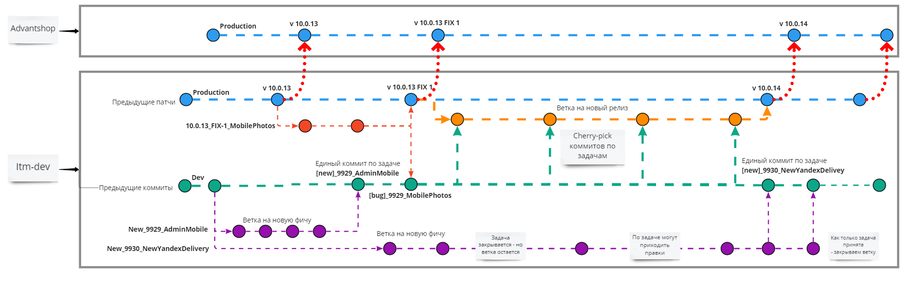
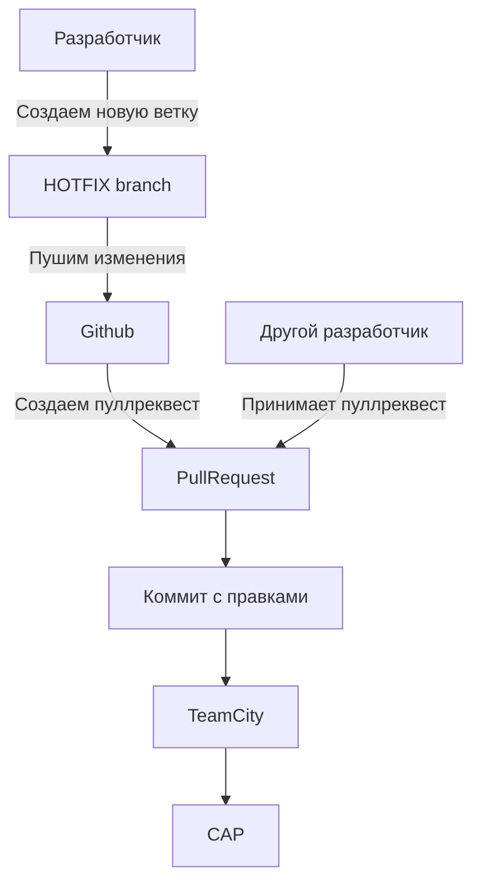
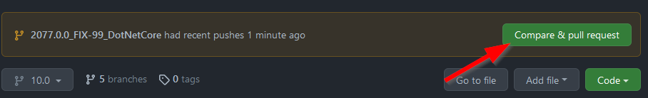
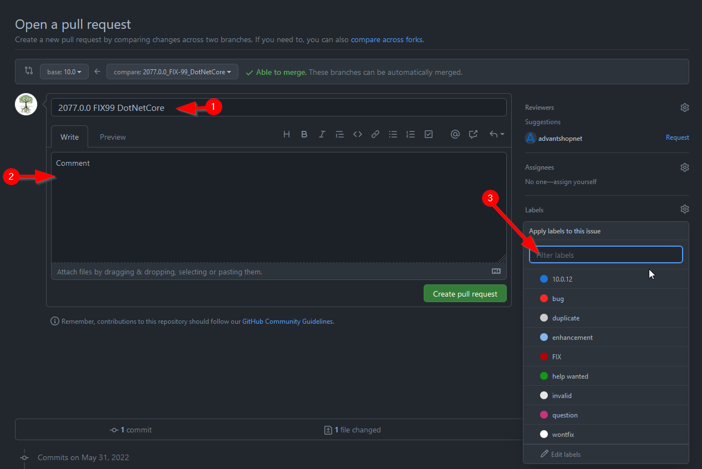

<p align="center">
  <a href="https://www.advantshop.net" target="_blank">
    
  </a>
</p>
<div align="center">
  
  <p align="center">  
    
    
  </p>
</div>

# Описание структуры проекта

<div>
  <div align="middle" float="left">
    
    
  </div>
  
</div>

## Webpack

<details>
<summary>
<b>
Обобщенная информация о командах
</b>
</summary>

- Сборка в режиме продакшена
    ```sh
    npm run build
    ```
- Сборка в режиме разработки
    ```sh
    npm run dev
    ```
- Сборка critical css
    ```sh
    npm run criticalcss
    ```
- Сборка в режиме разработки с включенным режимом watch (отслеживание изменений)
    ```sh
    npm run start
    ```
- Запуск тестов
    ```sh
    npm run test
    ```
- Сборка стилей в лендингах
    ```sh
    npm run landing-styles
    ```
- Сборка стилей в административной части
    ```sh
    npm run admin-styles
    ```
</details>
<br>
<details>
<summary>
<b>
Инструкция по сборке основной части фронтенда
</b>
</summary>

1. Выполнить чистую установку пакетов

```sh
npm install
```

2. Вызвать сборку

```sh
npm run <mode>

Options:
  mode            Bundle mode: development or production    [choices: "dev", "build"]
```

</details>
<br>
<details>
<summary>
<b>
Инструкция по сборке модулей
</b>
</summary>

1. Выполнить чистую установку пакетов

```sh
npm install
```

2. Вызвать сборку модулей

```sh
npm run build -- <options>

Options:
  -b                Сборка всех модулей
  -c <ModuleName>   Собрать определенный модуль
```

</details>
<br>
<details>
<summary>
<b>
Инструкция по сборке шаблонов
</b>
</summary>

1. Выполнить чистую установку пакетов

```sh
npm install
```

2. Вызвать сборку основной части фронтенда

```sh
npm run build
```

3. Вызвать сборку шаблонов

```sh
npm run build -- <options>

Options:
  -a                  Сборка всех шаблонов
  -l <TemplateName>   Собрать определенный шаблон
```

</details>

# Создание и сборка HOTFIX'ов

#### Общая схема процесса:



<details>
<summary>
<b>
Создание
</b>
</summary>

1. Создаем новую ветку из продакшен ветки (release)
```sh
git checkout -b <new-branch-name>
```
> **Желательно:** 
> выбирать понятное именование ветки, например по следующему шаблону: **{Version} FIX-{FixVersion} {FixName}**
> Например: **2077.0.0_FIX-99_DotNetCore**
2. Коммитим свои изменения (не забывая изменить Web.config (см. <a target="_blank" href="https://wiki2.advant.shop/wiki/286/cap-%d0%9c%d0%b8%d0%ba%d1%80%d0%be%d1%84%d0%b8%d0%ba%d1%81%d1%8b-%d0%a0%d0%b5%d0%b3%d0%bb%d0%b0%d0%bc%d0%b5%d0%bd%d1%82-%d1%84%d0%be%d1%80%d0%bc%d0%b8%d1%80%d0%be%d0%b2%d0%b0%d0%bd%d0%b8%d1%8f-%d0%bc%d0%b8%d0%ba%d1%80%d0%be%d0%bf%d0%b0%d1%82%d1%87%d0%b5%d0%b9">Вики инструкция </a>))
3. Пушим ветку в github
```sh
git push
```
4. Заходим в github
5. Переходим в ветку
6. Создаем pull request

> **Создаем pull request**
> 
> 
> **Заполняем его**
> 
> 1. Ясное название
> 2. Описание изменений, задачи по которым они вносились
> 3. Добавляем Теги - номер версии для которой вносятся правки и тег **FIX**
> 4. Нажать кнопку создать
7. Вы восхитительны!
</details>
